## Instruction to run the application :


#### Install Following Python Libraries using pip :
Eg. pip install library_name
- flask
- flask_wtf
- PIL
- numpy
- pymysql


#### Install MySql Server
Link - https://dev.mysql.com/downloads/mysql/

```sql
-Create Database IN MYSQL
database name : flaskblog
Edit username,password,databasename,hostname in config.ini file

Following Tables Should be Created :
drop table POSTS;
drop table USER;
commit;
```


**USER TABLE CREATION QUERIES**

```sql
CREATE TABLE USER (USER_ID INTEGER primary key auto_increment,
USERNAME VARCHAR(50) unique,
EMAIL VARCHAR(100) UNIQUE,
PASSWORD VARCHAR(256) NOT NULL,
IMAGE_FILE VARCHAR(256) DEFAULT 'PUBG.JPG'
);
```


**POSTS TABLE CREATION QUERIES**

```sql
CREATE TABLE POSTS (POST_ID INT(11) PRIMARY KEY auto_increment,
TITLE VARCHAR(100) NOT NULL,
CONTENT VARCHAR(10000),
DATE_POSTED TIMESTAMP DEFAULT current_timestamp,
FOREIGN KEY (USER_ID) REFERENCES USER(USER_ID) ON DELETE CASCADE
);
```

> commit;


### Snipptes

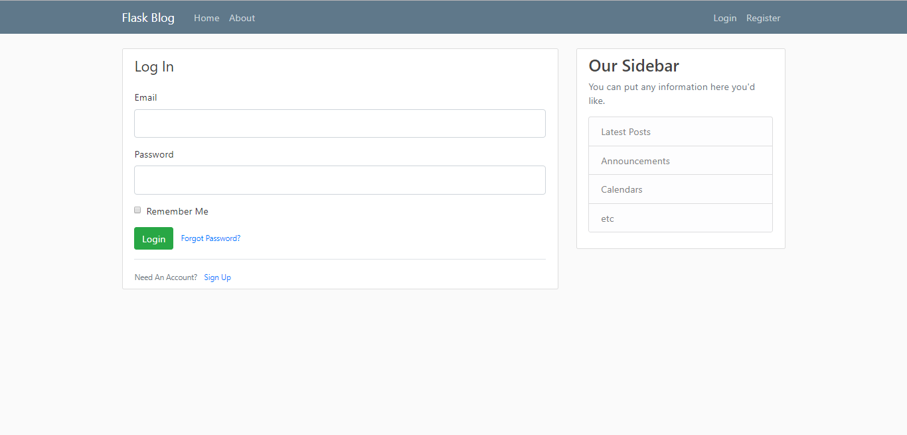
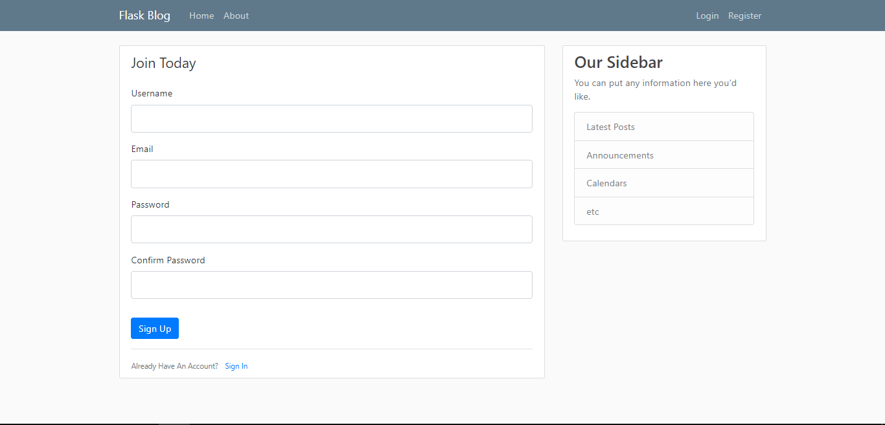
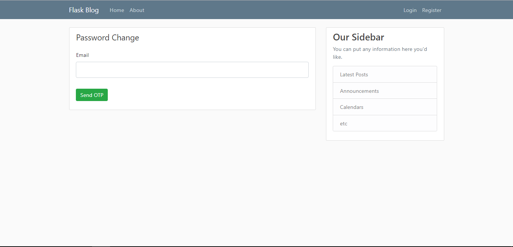
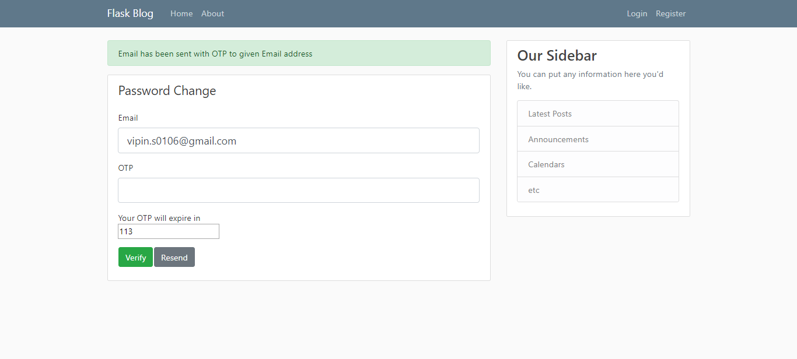
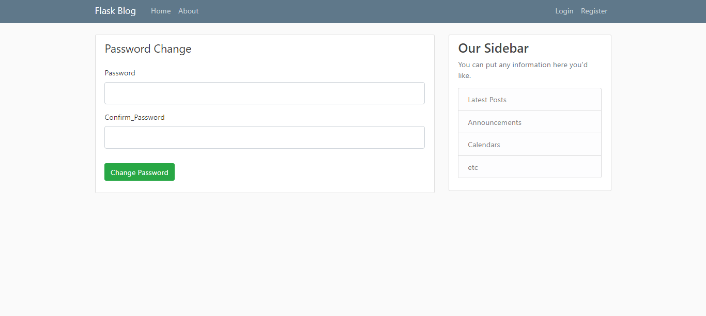
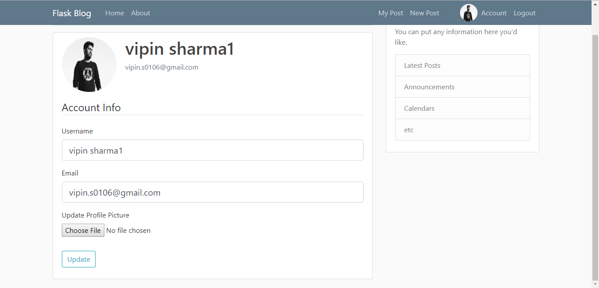
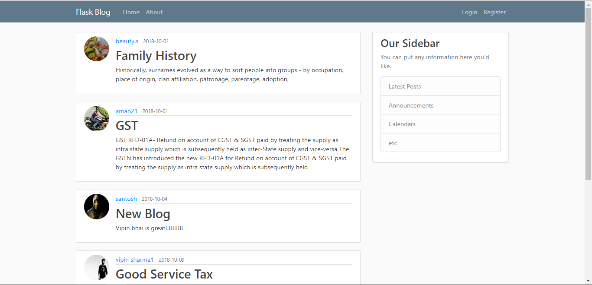
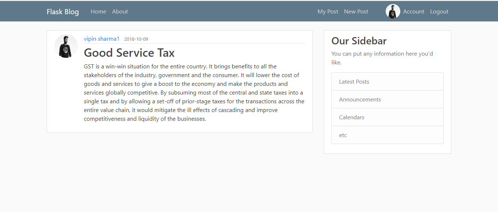
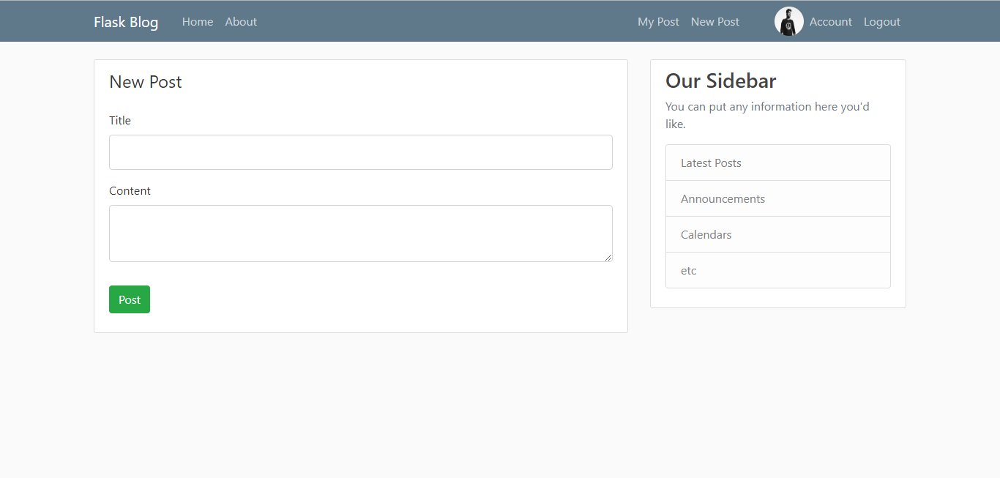
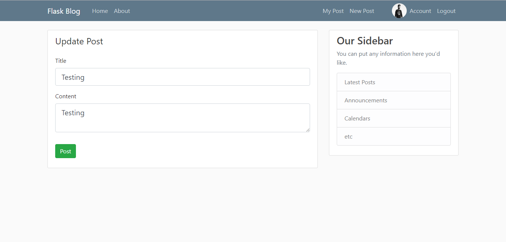
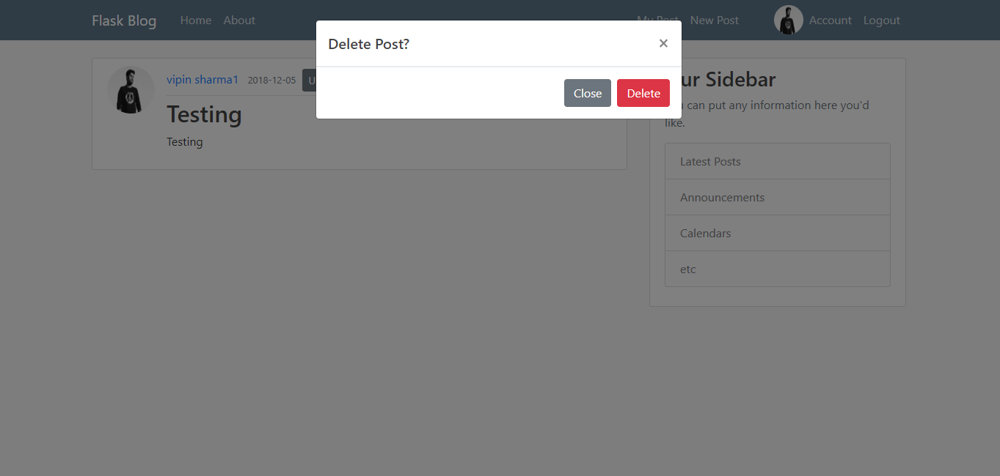

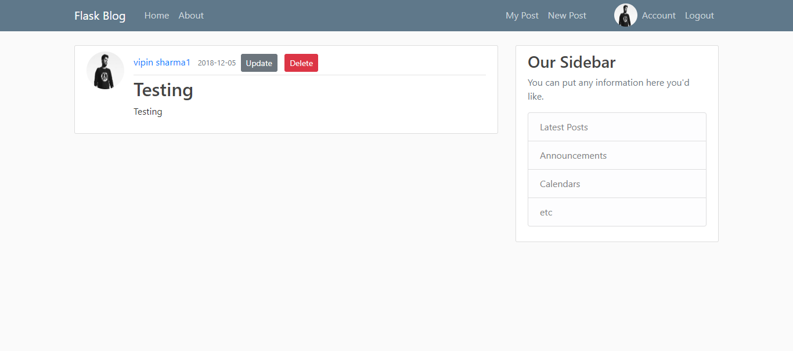


